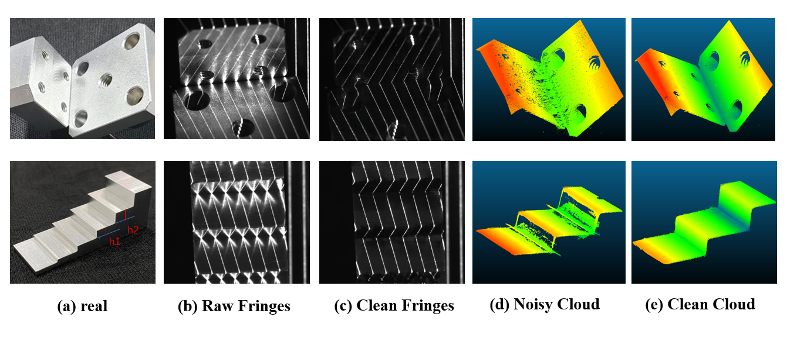
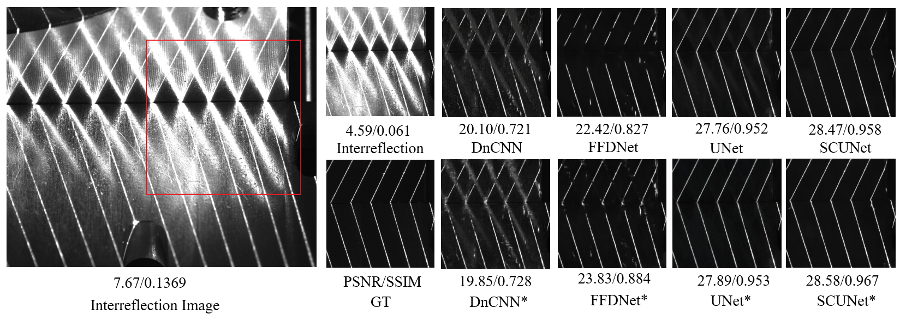
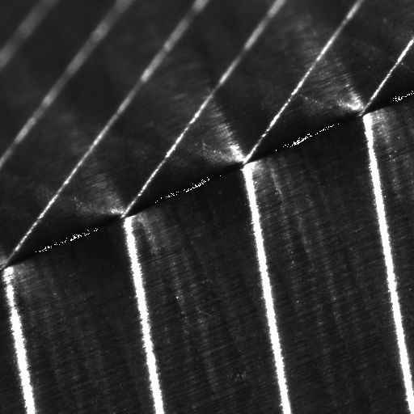

# Swin-TLS: Temporal Line-Shifting with Swin Transformer for 3D Reconstruction under Strong Interreflection

**Swin-TLS** is a modular deep learning processing platform developed to address the **strong interreflection** issue on highly reflective metal surfaces (e.g., deep holes, grooves) in Fringe Projection Profilometry (FPP). This project focuses entirely on the algorithmic and data-processing level, providing an end-to-end image restoration pipeline to recover pure direct radiation components from contaminated temporal line-shifting fringe images. The system supports training, evaluating, and comparing multiple classic and state-of-the-art denoising networks.

<p align="center">
  
</p>

<p align="center">
  
  
</p>

## ✨ Core Features

- **Optimized for Line-Shifting Structured Light**: By utilizing the sparse characteristics of binary multi-line patterns, the system effectively frames interreflection suppression as a deep learning-based structured noise removal task. This algorithmic choice completely bypasses the large-scale illumination aliasing common in global coding methods (e.g., Gray codes).
- **Hybrid Dataset Support (Virtual & Real)**:
  - **Real-captured Data**: A high-fidelity non-reflection Ground Truth (GT) acquisition strategy designed based on the reflection uniqueness of convex surfaces.
  - **Simulated Data**: Large-scale pixel-aligned simulation datasets generated using the **Blender Cycles** path-tracing renderer by precisely controlling the number of light bounces to decouple direct and indirect illumination.
- **Custom Composite Loss Function**: Designed for extreme class imbalance in structured light restoration (predominantly dark background, sparse bright lines). The strategy uses a **Composite Loss (Model Default + WeightedMSE + Edge-aware + Focal)** with phased weight adjustments to prevent detail loss and "brightness collapse" caused by over-suppressing large-scale highlights.
- **Powerful Model Comparison Matrix**: Built-in support for 4 classic and frontier denoising models: **DnCNN, U-Net, FFDNet, and SUNet**. It particularly validates the superior performance of **SUNet** in modeling long-range spatial dependencies and handling high-resolution structured noise.
- **Comprehensive Engineering Pipeline**: Supports multi-dataset merged training, oversampling/undersampling, Patch-based training, data augmentation, and integrated TensorBoard monitoring with checkpoint resume functionality.

## 🧰 Supported Models

| **Model Architecture** | **Features**                                                 | **Default Loss** | **Reference**            |
| ---------------------- | ------------------------------------------------------------ | ---------------- | ------------------------ |
| **DnCNN**              | 17-layer CNN, residual learning; stable for Gaussian noise.  | MSE              | Zhang et al., 2017       |
| **U-Net**              | Encoder-decoder with skip connections; preserves multi-scale features. | MSE              | Ronneberger et al., 2015 |
| **FFDNet**             | Noise-level-aware; high computational efficiency.            | L1               | Zhang et al., 2018       |
| **SUNet**              | **(Recommended)** Swin Transformer U-Net; combines global modeling with local refinement, perfect for structured noise. | L1               | Official Impl.           |

## 🚀 Installation

Bash

```
# Clone the repository
git clone <repo-url>
cd Swin-TLS

# Create conda environment
conda create -n Swin-TLS python=3.10
conda activate Swin-TLS

# Install PyTorch (CUDA 11.8, optimized for Quadro RTX 5000)
pip install torch==2.7.1+cu118 torchvision==0.22.1+cu118 --index-url https://download.pytorch.org/whl/cu118

# Install other dependencies
pip install -r requirements.txt
```

*Key dependencies: PyTorch 2.7.1, TensorBoard 2.20, scikit-image 0.25, matplotlib 3.10, PyYAML 6.0, tqdm 4.67.*

## 📁 Dataset Structure

The dataset covers various surface roughness levels and machining processes (planar milling, end milling, planar grinding) for metal workpieces.

*(Supported formats: PNG, JPG, BMP, TIFF - case-insensitive)*

Plaintext

```
data/
├── aluminum/          # Aluminum 6061 (Real-captured, roughness 0.8~3.2)
│   ├── input/         # Interreflection-polluted images
│   └── target/        # Clean images (Synthesized via differential strategy)
├── iron/              # 45# Carbon Steel (Various roughness and processes)
│   ├── input/
│   └── target/
└── Synthesis/         # Blender-rendered dataset (Complex geometry workpieces)
    ├── input/         # Reflection: ON
    └── target/        # Reflection: OFF
```

*Note: During training, high-resolution original images (e.g., 2048x1376) are randomly cropped into 512x512 patches to manage memory and perform data augmentation.*

## ⚙️ Configuration

The project uses YAML configuration files. You can switch models by modifying `model.name`.

| **Config File**                     | **Description**                                              |
| ----------------------------------- | ------------------------------------------------------------ |
| `configs/config_combined_loss.yaml` | **Combined Loss (Recommended)**: Model Default + WeightedMSE + Edge + Focal. Optimized for extreme class imbalance. |
| `configs/config_default_loss.yaml`  | Uses the model's standard loss function (e.g., MSE or L1).   |
| `configs/config_test_loss.yaml`     | For quick testing with small samples.                        |

**Switch models with one line:**

YAML

```
model:
  name: "sunet"  # Options: dncnn, ffdnet, sunet, unet
```

## 💻 Usage

**Training**

Bash

```
# Train with Combined Loss (Recommended for fine-line restoration)
python main.py train --config configs/config_combined_loss.yaml

# Train with default loss
python main.py train --config configs/config_default_loss.yaml

# Resume training from a checkpoint
python main.py train --config configs/config_combined_loss.yaml --resume experiments/<exp_id>/checkpoints/checkpoint_epoch_25.pth
```

**Data Augmentation & LR Strategy**

- **Augmentation**: Random cropping (512x512), random horizontal/vertical flipping, and random 90° rotation.
- **LR Scheduler**: Default uses `CosineAnnealingLR` decaying to `eta_min: 0.000001`.

## 📊 Performance & 3D Reconstruction Results

Key metrics on the test set using the **Combined Loss** strategy:

- **SUNet\***: PSNR 25.49 dB / SSIM 0.9212 (Best performing)
- **U-Net\***: PSNR 23.69 dB / SSIM 0.8422

By inputting the network's output ("cleaned" images) into the multi-frequency heterodyne reconstruction pipeline, 3D point cloud accuracy is significantly improved. In standard metal step-block measurements, the height measurement error was reduced from **0.081mm to 0.021mm** (a **74% reduction**).

## 📂 Project Structure

Plaintext

```
├── main.py                    # Main entry (train/evaluate/compare)
├── configs/                   # Configuration files
├── data/
│   ├── dataset.py             # Dataset loading (Merging, sampling)
│   ├── transforms.py          # Augmentations (Crop, flip, rotate)
│   └── __init__.py
```